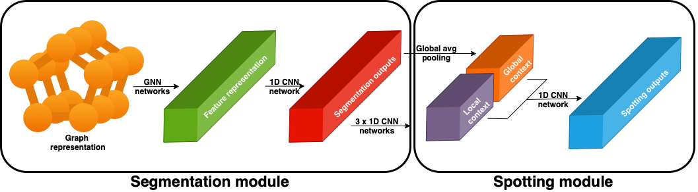

# Football Event Spotting using Graph Neural Networks (GNNs)

This repository contains the code and resources for my thesis project, "Graph Neural Networks for event detection in footbal" The project involves building a tool for event spotting in football matches using advanced machine learning techniques including GNNs, Context Aware Loss Function, NetVLAD, and Convolutional Neural Networks to capture both spatial and temporal information.


## Overview

The goal of this project is to develop a tool that can accurately spot events in football matches by using Graph Neural Networks (GNNs) and other advanced techniques. The model is divided into two main modules: segmentation and spotting. The segmentation module encodes graph representations of video clips into contextual data using GNNs and a context-aware loss function. The spotting module then decodes this contextual information to detect specific events.

## Pipeline

The following image illustrates the pipeline of the model, showcasing the segmentation and spotting modules:



## Thesis Files

The thesis documentation and presentation are included in the `thesis_files` directory:
- **Thesis Document**: `thesis_files/Thesis_Karol_Ziolo.pdf`
- **Final Presentation**: `thesis_files/thesis_presentation.pptx`

## Project Structure

The project is organized into the following directories and files:

- **src**: Contains all source code and subfolders
  - **data_management**: Files for data preprocessing and loading
  - **module**: Scripts for training models, calibrators, and animation/evaluation classes
  - **models**: Trained detectors used in the thesis
  - **calibrator**: Calibration models
  - **analysis**: Files for generating game animations and visualizing losses or evaluation metrics
  - **helpers**: Helper functions
  - **GPUtraining**: Scripts for training models on the GPU lab
  - **notebook**: Notebooks for analysis and evaluations
  - **model.py**: Contains all model architectures used
  - **Dockerfile**: Builds a Docker image for training models on the GPU lab

## Installation

To install the necessary dependencies, run:

```bash
pip install -r requirements.txt
```

## Usage

### Running the Code

1. **Data Management**:
   - Preprocess and load data using the scripts in the `data_management` folder.

2. **Training Models**:
   - Use the scripts in the `GPUtraining` folder to train models and calibrators.

3. **Animation and Evaluation**:
   - Generate game animations and visualize evaluation metrics using scripts in the `analysis` folder.

4. **Running on GPU Lab**:
   - Use the `GPUtraining` scripts and the `Dockerfile` to set up and train models on a GPU environment.

### Notebooks

- Open and run the notebooks in the `notebook` folder for detailed analysis and evaluations.

### Example Commands

To train a model, navigate to the `src` directory. Fill the paths in the script you plan to run and then run the following command:

Train segmentation model:
```bash
python GPUtraining/trainGAT.py
```

Train spotting model:
```bash
python GPUtraining/trainGAT_spotting.py
```

To generate animations:

```bash
python analysis/top_missed_predictions.py -m models/spotting_GAT.pth.tar -a "Shot" -t 5 -o animations/shot
```
